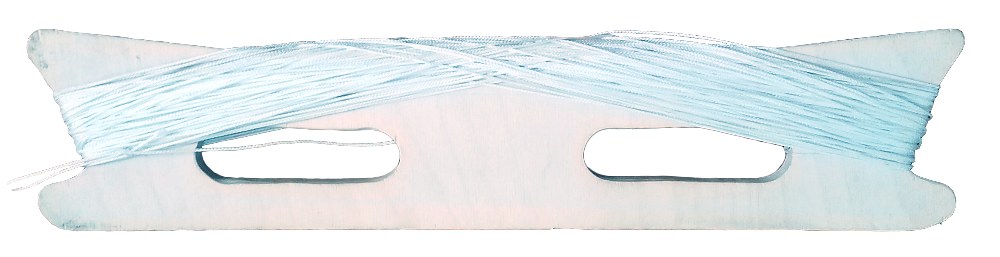
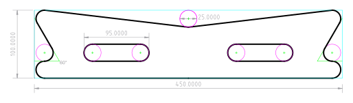
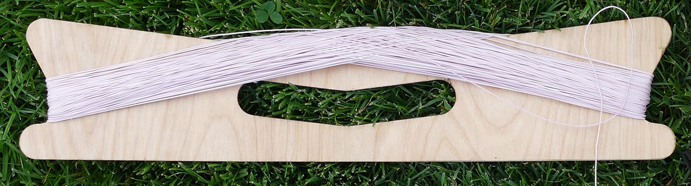

# ∞ flat line winder ∞
 

This kite line winder is designed for a figure eight winding technique. Winding line in a figure eight ∞ folds the line so that there is no twist. 
Line can also be thrown off the winder rapidly:

The winder is 450mm (18") long and can hold about 500' of 150lb dacron line (150m of 70kg line).

# how to make the winder

Download the SVG or DXF file in the root directory and cut from 1/2" (12mm) plywood or similar material.

 Drill out the pink drill holes with a 1" (25mm) hole saw or drill bit, and finish the cuts with hand or power tools. Or use a CNC mill.

 All design files are in mm. 1 unit = 1 mm for SVGs. The design can be converted to convenient inch measurements by assuming 1" = 25mm.

# about this design

This design was inspired by sport kite winders and the [G-Kites](https://www.gkites.com/store/) Wooden Line Winder. Winder features I want:

* One person can both wind line and fly the kite.
* Line can be given to the kite smoothly.
* Line twisting is minimized or eliminated.
* Fits in a 5" (130mm) cardboard tube with a kite.
* Has no moving parts.
* Can be made with basic tools.
* Material efficient and easy to make in batches.

See more of my kite and balloon projects at [headfullofair.com](https://headfullofair.com).

### contribute

* Replicate the winder and document your use of it. Please [reach out](https://headfullofair.com/contact) and share.
* Fork this repository and improve the design or documentation.
* Add or comment on [issues in this repository](/issues).
* [show me](https://headfullofair.com/contact) kite and balloon stuff.

All contributors are asked to abide by the [code of conduct](codeofconduct.md).

# things to change

Consider moving the handles. Their current placement was chosen for rigidity, as cutting out the middle handle can lead to warping given the current shape. 

The side handles are convenient for letting line out, and the middle handle is a bit easier when winding line in. I don't know which has better ergonomics overall.

*Licensed under the [CERN OHL 1.2](LICENSE.md)*.

