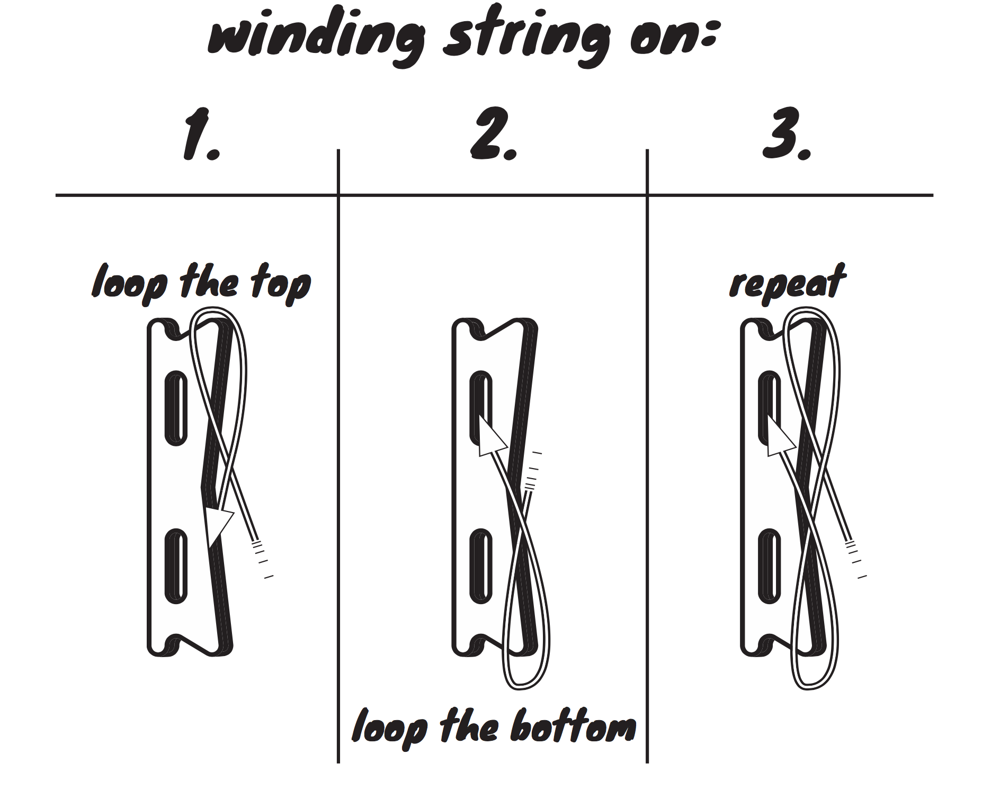
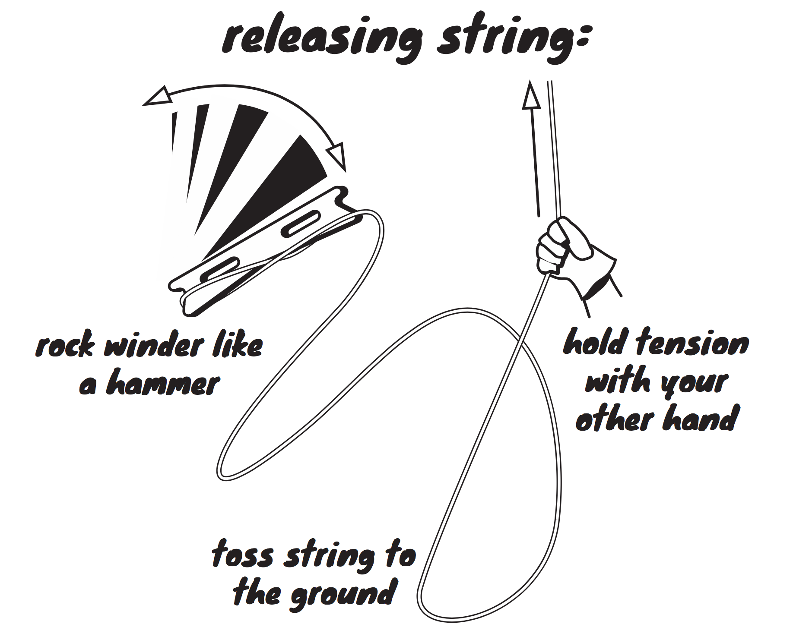

# ∞ flat line winder ∞
 

This kite line winder is designed for a figure eight winding technique. Winding line in a figure eight ∞ folds the line so that there is no twist. Find more media on [headfullofair.com/tags/flat-winder](headfullofair.com/tags/flat-winder).

# using the winder

Line can also be thrown off the winder rapidly:

The winder is 450mm (18") long and can hold about 500' of 150lb dacron line (150m of 70kg line).

[Watch a video of it in action](https://www.headfullofair.com/post/flat-line-winder/)

# how to make the winder

Download the [SVG](winder2.svg) or [DXF](winder2.dxf) file in the root directory of this repository and cut from 1/2" (12mm) plywood or similar material. All design files are in mm and were made with [QCAD](https://qcad.org/). 

Drill out the pink drill holes with a 1" (25mm) hole saw or drill bit, and finish the cuts with hand or power tools. Or use a CNC mill.

1 unit = 1 mm for SVGs. The design can be converted to convenient inch measurements by assuming 1" = 25mm.
 

# about this design

This design was inspired by sport kite winders and the [G-Kites](https://www.gkites.com/store/) Wooden Line Winder. Winder features I want:

* One person can both wind line and fly the kite.
* Line can be given to the kite smoothly.
* Line twisting is minimized or eliminated.
* Fits in a 5" (130mm) cardboard tube with a kite.
* Has no moving parts.
* Can be made with basic tools.
* Material efficient and easy to make in batches.

See more of my kite and balloon projects at [headfullofair.com](https://headfullofair.com).

### contribute

* Replicate the winder and document your use of it. Please [reach out](https://headfullofair.com/contact) and share.
* Fork this repository and improve the design or documentation.
* Add or comment on [issues in this repository](https://github.com/mathewlippincott/flat-winder/issues).
* [show me](https://headfullofair.com/contact) kite and balloon stuff.

All contributors are asked to abide by the [code of conduct](codeofconduct.md).

# things to change

Consider moving the handles. Their current placement was chosen for rigidity, as cutting out a middle handle can lead to warping. 

The side handles are convenient for letting line out, and the middle handle is a bit easier when winding line in. I don't know which has better ergonomics overall.

*Licensed under the [CERN OHL 1.2](LICENSE.md)*.

