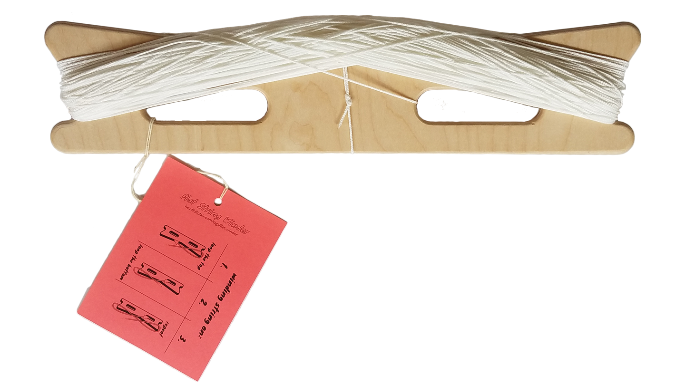

# ∞ a flat kite line winder ∞
 

This kite line winder is designed for a figure eight winding technique. Winding line in a figure eight ∞ folds the line so that there is no twist. The winder is 450mm (18") long. 

Line can also be thrown off the winder rapidly:

Read and watch more about using the winder at [headfullofair.com](http://headfullofair.com).

# how to make the winder

Download the SVG or DXF file in the root directory and cut from 1/2" plywood or other strong board. 

 Drill out the pink drill holes with a 25mm (1") hole saw or drill bit, and finish the cuts with hand or power tools. Or use a CNC mill.

1 unit = 1 mm for all SVGs.

### about this project repository

This design is licensed under [CERN OHL 1.2](LiCENSE.md). To learn more about contibuting, please read the [contribution guidelines](contributing.md).

